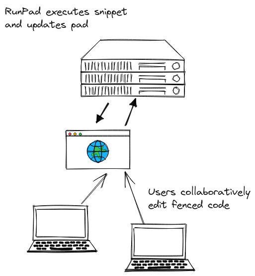
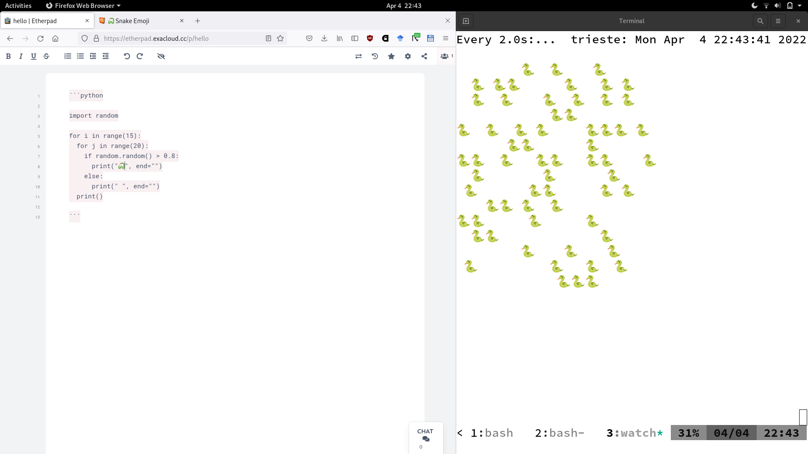

# runpad

Run code from etherpad. Designed for collaborative use, e.g. in the classroom.
Works with any publicly accessible pad.

Use cases:

* classroom: people can write code together, correct, discuss and extend code
  and see the results immediately
* development, e.g. debugging, snippets, interviews or pair programming

How it works:

* register your pad on [runpad.xyz](https://runpad.xyz)
* go to your own runpad output page and see stdout of your code, updated in real-time

What code is executed?

* we use the familiar code fence feature of markup languages
* everything after the programming language name is passed as options

```python name=quicksort

def quicksort():
    pass

```

Example runpad output page (demo): [runpad.xyz/r/hLMdySJlhd](https://runpad.xyz/r/hLMdySJlhd)

Each instance gets a scratch space for files as well. Each pad also gets access
to a virtual filesystem containing a variety of data.



## Usage

```
$ RUNPAD_BASE_URL=http://example.com/api RUNPAD_APIKEY=123 runpad -h
Usage of runpad:
  -a string
        etherpad api key (default "123")
  -c    show pad contents and info
  -l    list pads
  -p string
        pad name to watch (default "runpad")
  -r int
        run snippet with given id (default -1)
  -s    list snippets
  -u string
        etherpad base URL (default "http://example.com/api")
```

## Security

* each pad gets a sandbox execution environment, that limits operations
* each code snippet is allowed to run for a fixed number of seconds after which it is killed
* each pad can make outgoing requests, but they are monitored and bandwidth limited


## MVP

```
$ watch ./runpad -r 0 -p hello
```



## TODO

* [ ] container sandbox
* [ ] only run code on change
* [ ] implement `watch` like monitor
* [ ] webpage to follow output

